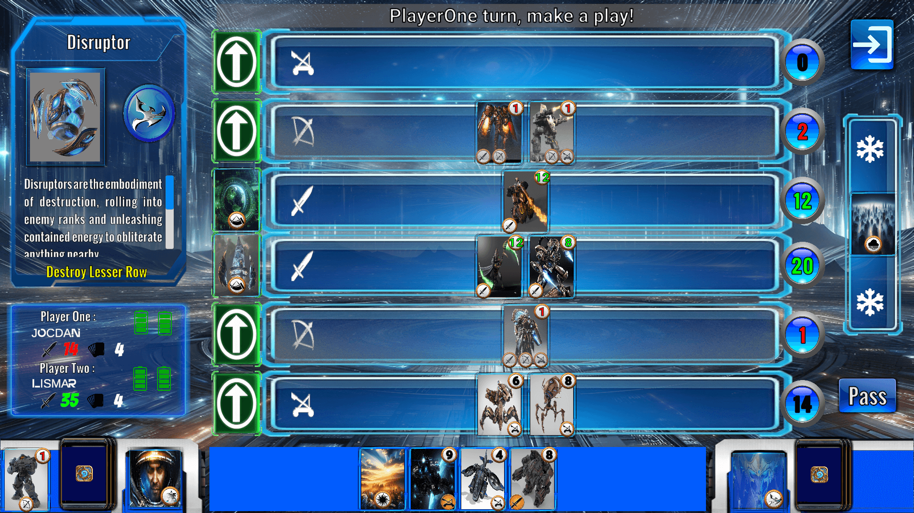

# GewntPro-Starcraft

## Description : 

Welcome to GwentPro-Starcraft, a board card game where the mighty races of  the Kropulu Sector  -The advanced protoss, the relentless terrans and the all consuming swarm of the zerg - confront its armies in battle for the dominion of the sector.Each race is represented by a Leader who bears and special power (Leader Effect), and its follower troops categorized in two groups : golden units and silver units.
While they are supported by their own technological prowess (Buff cards), they are also subject to the unpredictable and sometimes harsh conditions imposed by nature (Weather Cards).In each round, victory goes to the player who amasses the greatest effective Firepower during the battle.The first player to lose or draw to battles loses the game.

## User Manual:
For a more detailed description of the game refer to the user manual at : [link]

## Software Details: 
The game was developes with Unity 2022 which inherently uses C# as programming language
And Visual Studio Code 2024 was used text editor

### Author : 
* Jocdan Lismar López Mantecón
Computer Science Student, University of Havana
* email : jocdan.lopez@estudiantes.matcom.uh.cu