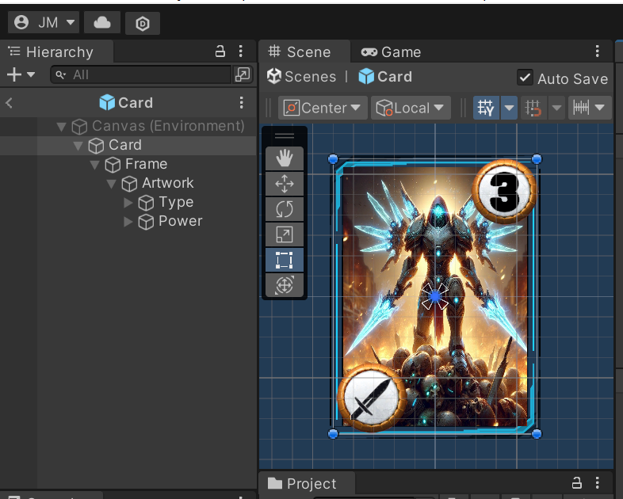

# GwentPro-Starcraft


## Description :

<div align="justify">

Welcome to GwentPro-Starcraft, a board card game where the mighty races of the Koprulu Sector - The advanced Protoss, the relentless Terrans, and the all-consuming swarm of the Zerg - confront their armies in battle for the dominion of the sector. Each race is represented by a Leader who bears a special power (Leader Effect), and its follower troops categorized into two groups: golden units and silver units.
While they are supported by their own technological prowess (Buff cards), they are also subject to the unpredictable and sometimes harsh conditions imposed by nature (Weather Cards). In each round, victory goes to the player who amasses the greatest effective Firepower during the battle. The first player to lose or draw two battles loses the game.

## Executing the game

To play the game, download the file GwentProStar.rar and extract its content. Then play the Gwent Game.exe file inside.

## Software Details

* The game was developed with Unity 2022 which inherently uses C# as a programming language.
* Visual Studio Code 2024 was used as a text editor.

### Author

* Jocdan Lismar López Mantecón
Computer Science Student, University of Havana
* email : jocdan.lopez@estudiantes.matcom.uh.cu

## Development

To design the application, a Top-Down structural analysis was carried out starting by determining the largest or more general components of the game, then breaking them down into smaller modules and components.

In this way, the major systems of the game are:

* Cards
* GameManager
* GameBoard

**Note**: The player module was deemed unnecessary for the role of the player is implicitly accomplished by the user interactions in the Game Interface.

### Cards

After analyzing the card as a key component of the game and its behavior, the "Card Entity" was represented as the combination of three components:

1) Card Information (Scriptable Object CardData)
2) Card Logic and Behavior (Script Card)
3) Visual Representation (Prefab Card)
  
#### Card Information

To create the card we need the information it will hold and represent. To accomplish this, the Unity scriptable object tool was used, for it's precisely "the tool for the job".
ScriptableObjects in Unity are a powerful feature that allows to create reusable, data-driven objects that can be manipulated in the Unity Editor. They are essentially data containers that can be referenced by other scripts or systems within the project. This makes them incredibly useful for managing game settings, configurations, and other data that needs to be easily accessible and modifiable without hardcoding values into the scripts.

A class hierarchy was created to model the different types of cards:

<div align="center">


</div>

#### Logic and Behavior

Similarly, a class hierarchy was designed for the card behavior scripts with some differences for the behaviors introduces further differences in the class (i.e., the golden and silver units contain the same information but the silver unit has different behaviors like modifying its power and controlling the Weather - Buff system)


### Game Manager

The Game Manager is serves a central component of the application charged with controlling and directing the flow of the game,
validating and executing the plays. For it has more than one responsibility, it was refactored into several modules leading to the creation of a **"Game Management System"**: an application-global system composed by the following modules:

* GameManager : Directs the flow of the game
* TurnManager: Navigates through the different phases of a turn;
* Card Manager: Validates and executes the plays, implementing the mechanism that controls the card movement and behavior in game.
* Effect Manager: Executes each card effect;

To achieve this global access, the Singleton Design Pattern was used. The Singleton Pattern ensures a class has only one instance and this instance is static providing a global point of access to it.

``` csharp
    // Singleton GameManager Instance
    public static GameManager Instance { get; private set; }

    // Ensure there is always one and only one static(and thus global) instance of this class
    void Awake()
    {
        if (Instance == null) Instance = this;
        else if (Instance != this) Destroy(gameObject);
    }

```

The Game and Turn Managers were implemented using a sort of State Machine by defining Enums of the possible states and providing well-defined mechanisms to Change and Execute each state:

``` csharp
public enum GameState { Start, Round, RoundEnd, Victory }
public enum TurnPhase { Draw, Play, Summon, SelectRow, SelectCard, TurnEnd }

public void UpdateGameState(GameState newState)
    {
        this.GameState = newState;
        HandleState(newState);
    }

private void HandleState(GameState newGameState)
    {
        Debug.Log(newGameState);
        switch (newGameState){...}
        Debug.Log(GameState);
    }


public void UpdateTurnPhase(TurnPhase newPhase, float timeDelay = 0)
{
        CurrentTurnPhase = newPhase;
        HandleTurnPhase(newPhase, timeDelay);
}

private void HandleTurnPhase(TurnPhase newPhase, float timeDelay)
{
        Debug.Log($"{newPhase}");
        void HandleNewPhase(){
        switch (newPhase){...}
        }
}

```

#### Visual Representation : 

The visual representation of the card consist in a Unity GameObject created component by component:
The card has Frame, an Image representing the artwork of the card( The main picture), an Image that contains an icon that represent the card type and a TextMeshPro for the card Power.

Using the Unity prefab and variants system a hierarchy for the different types of card was created
having the card prefab as roots and its children(variants) are :

<div align="center">




</div>

From, the Silver Unit variant another child was created the Golden Unit for the golden unit is almost identical to its parent only changing the color of the Circular Icon Holders

### GameBoard

The GameBoard was factorized as follows:

A GameBoard has two player fields, and a WeathersRow.
Each Field has a battlefield(three rows), a deck, a graveyard, a leader

The GameBoard was factorized as follows:

A GameBoard has two player fields, and a WeathersRow.


Each Player Field has a battlefield(three rows), a deck, a graveyard, a Leader and a Player Info


Each Row has a list of cards and a buff


For each of this components (but the Graveyard) a script to represent its data and behavior was created.

During the implementation of the frontend further restructurings were required to economize the space in the screen.

### Difficult Challenges and Solutions

The most difficult challenges in the game were:

* Effects Design
* Decoy Handling
* Buff and Weather Power Modifying Logic

#### Effects Design 

To design the effect the mains ideas were : An interface IEffect so the effect had to be classes that implement such interface and that were components of the cards.

The second and used was an switch over an Enum ,meaning : Creating an enum with all the effects, the Card base class has a property Effect effect where it declares on of such effects and when the card is summoned into the game the effect manager reads this property in the classy it using a switch and then call the corresponding method in response. For each effect a Method implementing the effect was created. In the class Effect Manager.

#### Decoy Handling

The decoy was handled as follows : When the player plays a decoy card, it is saved in a private field of the Card Manager *Card pendingCard*, then all the silver units in the current Player Field are scaled out to highlight them (if not any, the decoy cant be played so the game return to the previous state) and the player selects one of them. The selected card is returned to hand, removed from the pertinent data structures and the decoy card takes its place in the field.


</div>
