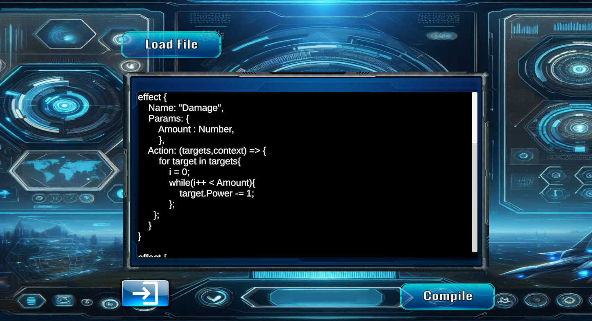

# Gwent Pro ++

Para este segundo proyecto de programacion Gwent Pro++ se añade la funcionalidad de crear cartas personalizadas utilizando un Lenguaje de Dominio Especí­fico (DSL)  dado por el profesorado, así­ como un intérprete para interpretar y ejecutar las instrucciones de dicho lenguaje. 

## Instrucciones

* En el menú principal del juego se encuentra el botón Card Builder el cual despliega una interfaz visual

 

* En la misma se encuentra el botón Load File que permite seleccionar desde una ventana del SO un archivo del tipo .txt y cargarlo, luego se muestra en pantalla el contenido del texto.
* Presiona el botón Compile el cual muestra una consola reportando los errores de compilación en caso de existir alguno o el texto "Program compiled succefully" en caso contrario. 
* Para jugar con las cartas creadas, en la interfaz de seleccion de facción se añadió una barra desplegable con todas las facciones disponibles incluyendo las facciones personalizadas
* En caso de no haber declarado nigún lider en una facción personalizada , se definió un lider por defecto perteneciente a la facción neutral , así mismo automáticamente se añaden al deck del jugador todas las cartas de la faccion neutral, que son cartas especiales que contienen todos los deck.
* Se tomó una imagen y logo predefenidos para las cartas creadas de esta manera.

## Desarrollo

Con este fin se diseñaron e implementaron las siguientes fases del proceso de compilación:

*  Análisis Léxico.
*  Analisis Sintáctico.
*  Análisis Semántico 
*  Evaluación. 

 ### Análisis Léxico
 
El análisis Léxico es el proceso mediante el cual se toma el código fuente dado en formato de texto y se transforma en "palabras" válidas del lenguaje, es decir, se lleva al alfabeto de nuestro lenguaje. Para ello se implementa la clase Lexer, cuyo principal componente es el tipo Token. Un token representa a una de estas "palabras" del lenguaje .Se crea con un tipo (de token), un Lexema, que es el texto literal que contiene y una ubicación en el código que es lugar que ocupa en el texto fuente dado por Fila y Columna. Se creó un enum TokenType donde se secuencian todos los tipos de tokens soportados en nuestro lenguaje . Para el desarrollo del lexer se emplearon expresiones regulares. Con este fin se creó un diccionario <TokenType, string>, donde a cada tipo de token se le hace corresponder el patrón que lo matchea en expresiones regulares. Así­, en cada paso del lexer se recorre con un ciclo foreach este diccionario, buscando a que patrón y por tanto a que tipo de token pertence el fragmento actual del código fuente priorizando según la longitud mas grande, es decir, y luego a las palabras claves. 
         
### Análisis sintáctico

En el análisis sintáctico se determinan las estructuras sintácticas u "oraciones válidas" del lenguaje. Para ello, se diseñaron un conjunto de producciones o reglas de producción, así como las clases que contendrán estas estructuras básicas, teniendo en mente la creación de un árbol de sintaxis abstracta AST. Se definió una clase abstracta base AST-Node que contiene una ubicación del código,
un método abstracto, Analizar la Semántica. Se creó la clase programa, el cual consiste en una lista de declaraciones. La clase abstracta de declaración, las cuales constituyen las entidades más grandes de nuestro programa. Y también
se diseñaron una serie de clases componentes de estas declaraciones, como serían el Action en la declaración del efecto, el OnActivation para la declaración de la carta y otros componentes.
Para el parsing de estas entidades se recorrió con un enfoque de máquina de estado donde se parsea una estructura determinada según el token que viene a continuación.
Para las estructuras más básicas del programa, que son las instrucciones y las expresiones, se utiliza el Parsing Recursivo Descendente.
Dentro de las instrucciones se concibieron ciclo For, ciclo While, instrucción de expresión y el bloque o cuerpo que constituye una lista de instrucciones de expresiones. Se soporta, ademas, llamados a métodos dados en el lenguaje,a propiedades e indexados en listas, así como expresiones aritméticas, booleanas y de concatenación de string.

### Analisis Semántico

El análisis semántico es la fase durante la cual se chequea el cumplimiento de una serie de reglas y requisitos que deben cumplir estas estructuras para que el programa tenga sentido y funcione correctamente.
Se desarrolló un análisis semántico estático previo, donde se buscaron cubrir la mayor cantidad de chequeos posibles, para reducir la cantidad de errores que solo se pueden tomar en tiempo de ejecución.
Para ello se desarrolló primeramente el chequeo de tipos. En la clase básica de expresión se incluye una propiedad ExpressionType, durante la creación de cada expresión se tiene que definir de qué tipo será esta expresión. Así, una vez culminado el analisis sintactico y creado el AST en cada nodo correspondiente a una se conoce qué tipo de expresión es esta, esto nos facilita, durante el análisis semántico previo el chequeo de tipos. Además, durante el análisis semántico se chequeó que se hayan declarado todas las estructuras o componentes que son estrictamente necesarios, como por ejemplo el nombre en la declaración de cartas y efectos, el tipo, la facción, etc. También se chequearon que estén correctamente utilizadas las propiedades y métodos.para ello se creó una especie de tabla de símbolos y un scope.

Se creo el tipo personzalizado Scope, basado en diccionarios, donde se utilizó la genericidad para poder posteriormente extender este scope a la evaluación. Durante el análisis semántico el scope se emplea de expression type. Está basado en un diccionario string - ExpressionType donde a lo largo del anális se van definiendo en el scope en este diccionario las variables que se han declarado identificadas univocamente por su nombre en formato de string y al que se le hace corresponder el tipo de cada una de estas variables para poder realizar el chequeo de tipos. También para el análisis de propiedades y métodos, se crea una suerte de tabla de símbolos que consiste en un diccionario donde a cada tipo del lenguaje se le hace corresponder una lista de miembros. Se crea una clase abstracta Miembro que pretende modelar los distintos miembros que tiene cada tipo. Es un diccionario  expressionType - Lista de miembros, De la clase de base miembro, se derivan propiedad y método. Así nos permite clasificar dichos miembros en propiedades o métodos. Propiedad tiene un nombre de la propiedad que tiene ese tipo y tiene el tipo de retorno de esa propiedad.
Los métodos tienen el tipo de retorno, el nombre del método y el tipo del argumento.

### Evaluación 

En la evaluacion: las instrucciones y expresiones se traducen a instrucciones y expressiones de C# de manera simple , utilizando casteo a los tipos correspondientes segun los operadores o tipo de expresion requerida.

En caso de los llamados a propiedades y métodos se utilizó la funcionalidad de Reflection de C# contenida en el namespace System.Reflection ya que la misma facilita la interaccion e invocación de campos de objetos de manera dinámica a partir de strings.

Para la creación de las cartas y effectos se implemento una base de datos que contiene una lista con las declaraciones previamente compiladas, una lista de effectos y de facciones.

## Anexos

### Adaptations in the DSL

* Card:
    - Type : Supported types are 'Golden', 'Silver', 'Leader' to preserve Game Definition and original mechanics

* PostAction:
    - PostAction Reworked to be an Activation member: 
      PostAction → "{" effect_instance "," selector ("," postAction)? "}";
      To facilitate the use of effect that requires adittional parameters as PostActions.
  
* Context
    - TriggerPlayer renamed to CurrentPlayer and added EnemyPlayer to context.

### Grammar :

#### Declaration

program → declaration*;
declaration → effect_declaration | card_declaration;

effect_declaration → "effect" "{" effect_body "}";
effect_body → effect_member+;
effect_member → |"Name" ":" STRING "," 
                 |"Params" ":" "{" (IDENTIFIER ":" IDENTIFIER)* "}" "," 
                 |"Action" ":" "(" IDENTIFIER "," IDENTIFIER ")" "=>"  "{" block"}"; 

block → statement*;

card_declaration → "Card" "{" card_body "}";
card_body → "Type" ":" STRING "," 
            "Name" ":" STRING "," 
            "Faction" ":" STRING "," 
            "Power" ":" NUMBER "," 
            "Range" ":" "[" STRING ("," STRING)* "]" "," 
            "OnActivation" ":" "[" activation_member ("," activation_member)* "]";

activation_member → "{" effect_instance "," selector ("," postAction)? "}";

effect_instance → "{" "Effect:" "{" "Name" ":" STRING ("," IDENTIFIER ":" literal )* "}" "," 
selector → "{" "Selector" ":" "{" selector_body "}" "}" "," ;
selector_body : "Source" ":" STRING "," 
                "Single" ":" BOOLEAN "," 
                "Predicate" ":" predicate;
predicate → "(" IDENTIFIER ")" "=>" expression;
postAction → "PostAction:" "{"Type:" STRING ("," selector)"}"? "}";

#### Statements:

Statement → expression_statement | for_statement | while_statement;
expression_statement → expression ";"
for_statement → "for" IDENTIFIER "in" IDENTIFIER "{" block "}";
while_statement → "while" "("expression")""{" block "}";

#### Expression:

*expression* → assignment ;
*assignment* → or ("=" assignment)*;
*or* → and ("||" and)* ;
*and* → equality ("&&" equality)*;
*equality* → comparison ( ( "!=" | "==" ) comparison )* ;
*comparison* → term ( ( ">" | ">=" | "<" | "<=" ) term )*;
*term* → factor ( ( "-" | "+" ) factor )* ;
*factor* → power ( ( "/" |"\*" ) power )*;
*power* → unary ("^" Power)*;
*unary* → ( "!" | "-" |"++"| "--")? call || call ("++"|"--")?;
*call* → IDENTIFIER ("[" expression "]")* ( "." IDENTIFIER (("(" args ")") | ("[" expression "]") *))? | primary;
*primary* → NUMBER | STRING | "true" | "false"| "(" Expression ")";